# GameWorldshaper Engine — Complete Architecture & Class Diagrams

**Date:** April 12, 2026  
**Status:** Comprehensive architectural planning for all systems  
**Scope:** Rendering, Editor, Missing Game Systems

---

# TABLE OF CONTENTS
1. [Rendering System Architecture](#rendering-system-architecture)
2. [Editor System Architecture](#editor-system-architecture)
3. [Character Controller System](#character-controller-system)
4. [Ability/Skill System](#abilityskill-system)
5. [AI System](#ai-system)
6. [Networking System](#networking-system)
7. [Audio System](#audio-system)
8. [Particle System](#particle-system)
9. [World Streaming System](#world-streaming-system)
10. [Quest/Dialogue System](#questdialogue-system)

---

# RENDERING SYSTEM ARCHITECTURE

## Overview
The rendering system is layered with abstraction at each level:

```
┌─────────────────────────────────────────────────────────────┐
│  Application Layer (Scene, Editor)                          │
├─────────────────────────────────────────────────────────────┤
│  SceneRenderer (High-level rendering API)                   │
│  ├─ DeferredRenderer (Complex scenes, many lights)          │
│  ├─ ForwardRenderer (Simple, transparency)                  │
│  └─ HybridRenderer (Both modes combined)                    │
├─────────────────────────────────────────────────────────────┤
│  Graphics Abstraction Layer                                 │
│  ├─ RenderDevice (GPU API abstraction)                      │
│  ├─ Shader, Material, Texture, Mesh                         │
│  ├─ Framebuffer, GBuffer                                    │
│  └─ RenderQueue, Batch, Frustum                             │
├─────────────────────────────────────────────────────────────┤
│  Low-level GPU APIs (OpenGL 4.6 / Vulkan future)            │
└─────────────────────────────────────────────────────────────┘
```

## Complete Rendering Class Diagram

```mermaid
classDiagram
    %% Core Device & Rendering
    class RenderDevice {
        -context: GLContext
        -capabilities: GPUCapabilities
        +Initialize()
        +Shutdown()
        +CreateShader(): Shader
        +CreateMesh(): Mesh
        +CreateFramebuffer(): Framebuffer
        +SetViewport()
        +Clear()
        +Present()
    }
    
    class Shader {
        -program_id: GLuint
        -vertex_src: string
        -fragment_src: string
        -uniforms: map~string,int~
        +Compile()
        +Link()
        +Bind()
        +SetUniform()
        +GetUniformLocation()
    }
    
    class Material {
        -shader: Shader
        -properties: MaterialProperties
        -textures: map~string,Texture~
        -pbr_params: PBRParameters
        +SetShader()
        +SetTexture()
        +SetProperty()
        +Bind()
        +GetProperty()
    }
    
    class MaterialProperties {
        +albedo: vec3
        +metallic: float
        +roughness: float
        +normal_strength: float
        +ao_intensity: float
    }
    
    class PBRParameters {
        +metallic: float
        +roughness: float
        +cavity_color: vec3
        +displacement: float
    }
    
    class Texture {
        -handle: GLuint
        -width: uint32
        -height: uint32
        -format: TextureFormat
        +Load()
        +Bind()
        +SetFilter()
        +SetWrapping()
    }
    
    class Mesh {
        -vertices: vector~Vertex~
        -indices: vector~uint32~
        -vao: GLuint
        -vbo: GLuint
        -ibo: GLuint
        -bounds: AABB
        +AddVertex()
        +SetIndices()
        +Upload()
        +Draw()
        +GetBounds()
    }
    
    class Framebuffer {
        -handle: GLuint
        -color_attachments: vector~Texture~
        -depth_attachment: Texture
        -width: uint32
        -height: uint32
        +Create()
        +Bind()
        +Unbind()
        +Resize()
        +GetColorAttachment()
    }
    
    %% G-Buffer & Deferred
    class GBuffer {
        -framebuffer: Framebuffer
        -attachments: vector~GBufferAttachment~
        -format: GBufferFormat
        +Create()
        +BeginGeometryPass()
        +EndGeometryPass()
        +BeginLightingPass()
        +EndLightingPass()
        +GetColorAttachments()
        +GetAttachment()
        +Clear()
        +Resize()
    }
    
    class GBufferAttachment {
        +index: int
        +format: GBufferFormat
        +texture: Texture
        +name: string
    }
    
    class DeferredRenderer {
        -device: RenderDevice
        -gbuffer: GBuffer
        -config: DeferredConfig
        -passes: vector~DeferredPass~
        -light_binner: TileLightBinner
        -profiler: GPUProfiler
        +Initialize()
        +BeginFrame()
        +GeometryPass()
        +LightCullingPass()
        +LightingPass()
        +ForwardPass()
        +CompositePass()
        +EndFrame()
        +Resize()
    }
    
    class DeferredPass {
        +name: string
        +shader: Shader
        +framebuffer: Framebuffer
        +enabled: bool
        +debug_visualize: bool
    }
    
    class DeferredConfig {
        +rendering_mode: RenderingMode
        +width: uint32
        +height: uint32
        +enable_light_culling: bool
        +enable_tile_deferred: bool
        +tile_size: uint32
    }
    
    class TileLightBinner {
        -tile_width: uint32
        -tile_height: uint32
        -tile_size: uint32
        -bins: vector~vector~Light~~
        +BinLights()
        +GetTile()
        +GetMaxTileLightCount()
    }
    
    class ForwardRenderer {
        -device: RenderDevice
        -light_manager: LightManager
        -material_system: MaterialSystem
        +Initialize()
        +Render()
        +DrawMesh()
        +UpdateLights()
    }
    
    %% Post-Processing
    class PostProcessor {
        -device: RenderDevice
        -effects: vector~PostProcessingEffect~
        -pingpong_fbs: vector~Framebuffer~
        +Create()
        +AddEffect()
        +RemoveEffect()
        +Process()
        +Resize()
    }
    
    class PostProcessingEffect {
        -shader: Shader
        -enabled: bool
        +Render()
        +SetParameters()
        +GetName()
    }
    
    class ToneMappingEffect {
        -tone_map_mode: ToneMappingMode
        -exposure: float
        +Render()
        +SetExposure()
    }
    
    class BloomEffect {
        -threshold: float
        -intensity: float
        -blur_sigma: float
        +Render()
        +SetThreshold()
    }
    
    class FXAAEffect {
        -quality: float
        +Render()
        +SetQuality()
    }
    
    %% Lights & Shadows
    class Light {
        -type: LightType
        -position: vec3
        -direction: vec3
        -color: vec3
        -intensity: float
        -enabled: bool
        +GetPosition()
        +GetDirection()
        +SetColor()
        +SetIntensity()
        +IsEnabled()
    }
    
    class DirectionalLight {
        -cascades: uint32
        -shadow_map_size: uint32
        -shadow_distance: float
        +GetLightMatrix()
        +UpdateCascades()
    }
    
    class PointLight {
        -range: float
        -attenuation: float
        +GetRange()
        +GetAttenuation()
    }
    
    class SpotLight {
        -inner_angle: float
        -outer_angle: float
        -range: float
        +GetInnerAngle()
        +GetOuterAngle()
    }
    
    class ShadowMap {
        -framebuffer: Framebuffer
        -depth_texture: Texture
        -light_matrix: mat4
        -bias: float
        +Render()
        +GetDepthTexture()
        +SetBias()
    }
    
    class LightManager {
        -lights: vector~Light~
        -shadow_maps: map~Light,ShadowMap~
        -max_lights: uint32
        +AddLight()
        +RemoveLight()
        +UpdateLights()
        +GetVisibleLights()
        +GetShadowMap()
    }
    
    %% Culling & Batching
    class Frustum {
        -planes: array~Plane,6~
        +ExtractFromViewProjection()
        +ContainsPoint()
        +IntersectsSphere()
        +IntersectsAABB()
        +GetCorners()
    }
    
    class Plane {
        +normal: vec3
        +distance: float
        +Distance()
        +ContainsPoint()
    }
    
    class StaticBatch {
        -instances: vector~BatchedMeshInstance~
        -mesh: Mesh
        -materials: vector~Material~
        -transform_buffer: GLuint
        +AddInstance()
        +RemoveInstance()
        +UpdateInstanceTransform()
        +SetInstanceVisible()
        +Draw()
        +GetStats()
    }
    
    class DynamicBatch {
        -instances: vector~BatchedMeshInstance~
        -indirect_buffer: GLuint
        -command_buffer: GLuint
        +DrawIndirect()
        +UpdateGPUBuffers()
        +GetStats()
    }
    
    class BatchedMeshInstance {
        +mesh: Mesh
        +material: Material
        +transform: mat4
        +visible: bool
        +instance_id: uint32
    }
    
    %% Profiling
    class GPUProfiler {
        -timers: map~string,GLuint~
        -results: map~string,float~
        +BeginFrame()
        +BeginPass()
        +EndPass()
        +EndFrame()
        +GetPassTime()
        +GetFrameTime()
    }
    
    class PerformanceProfiler {
        -scopes: map~string,ProfileScope~
        +BeginScope()
        +EndScope()
        +GetStats()
    }
    
    class ProfileScope {
        +name: string
        +total_time: float
        +min_time: float
        +max_time: float
        +call_count: uint32
    }
    
    %% Relationships
    RenderDevice --> Shader
    RenderDevice --> Mesh
    RenderDevice --> Framebuffer
    
    Material --> Shader
    Material --> Texture
    Material --> MaterialProperties
    Material --> PBRParameters
    
    Mesh --> RenderDevice
    Framebuffer --> Texture
    
    GBuffer --> Framebuffer
    GBuffer --> GBufferAttachment
    
    DeferredRenderer --> RenderDevice
    DeferredRenderer --> GBuffer
    DeferredRenderer --> DeferredPass
    DeferredRenderer --> DeferredConfig
    DeferredRenderer --> TileLightBinner
    DeferredRenderer --> GPUProfiler
    
    ForwardRenderer --> RenderDevice
    ForwardRenderer --> LightManager
    
    PostProcessor --> PostProcessingEffect
    PostProcessor --> Framebuffer
    
    ToneMappingEffect --> PostProcessingEffect
    BloomEffect --> PostProcessingEffect
    FXAAEffect --> PostProcessingEffect
    
    DirectionalLight --> Light
    PointLight --> Light
    SpotLight --> Light
    
    ShadowMap --> Framebuffer
    LightManager --> Light
    LightManager --> ShadowMap
    
    StaticBatch --> BatchedMeshInstance
    StaticBatch --> Mesh
    StaticBatch --> Material
    
    DynamicBatch --> BatchedMeshInstance
    
    Frustum --> Plane
```

## Rendering Data Flow

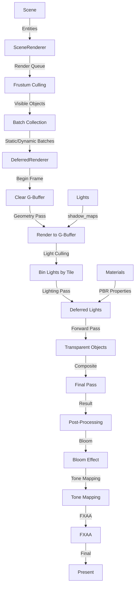

---

# EDITOR SYSTEM ARCHITECTURE

## Complete Editor Architecture

```mermaid
classDiagram
    %% Editor Main
    class Editor {
        -window: Window
        -imgui_context: ImGuiContext
        -editor_state: EditorState
        -scene: Scene
        -panels: vector~EditorPanel~
        -menus: vector~EditorMenu~
        +Initialize()
        +Update()
        +Render()
        +Shutdown()
        +LoadScene()
        +SaveScene()
        +IsRunning()
    }
    
    class EditorState {
        -selected_entity_id: uint32
        -viewport_size: ivec2
        -viewport_camera: ViewportCamera
        -show_hierarchy: bool
        -show_inspector: bool
        -show_viewport: bool
        -show_asset_browser: bool
        -show_profiler: bool
        -play_mode: bool
    }
    
    class EditorPanel {
        #name: string
        #visible: bool
        +ShowPanel()
        +HidePanel()
        +Update()
        +Render()
        +OnEntitySelected()
    }
    
    class SceneHierarchyPanel {
        -scene: Scene
        -selected_entity_id: uint32
        -filter_text: string
        -expand_all: bool
        +RenderEntityTree()
        +RenderEntityNode()
        +OnEntitySelected()
        +OnEntityRenamed()
        +OnEntityDeleted()
    }
    
    class InspectorPanel {
        -scene: Scene
        -selected_entity_id: uint32
        -component_add_menu_open: bool
        +RenderSelectedEntity()
        +RenderTransformComponent()
        +RenderComponents()
        +RenderAddComponentMenu()
        +RenderComponentProperties()
    }
    
    class ViewportPanel {
        -viewport_renderer: ViewportRenderer3D
        -viewport_camera: ViewportCamera
        -gizmo_manager: GizmoManager
        -grid_visible: bool
        -axes_visible: bool
        +RenderViewport()
        +HandleCameraInput()
        +RenderGrid()
        +RenderAxes()
        +RenderGizmos()
        +HandleGizmoInteraction()
    }
    
    class AssetBrowserPanel {
        -asset_manager: AssetManager
        -current_path: string
        -filter_type: AssetType
        -thumbnail_size: float
        -selected_asset: string
        +BrowseAssets()
        +RenderAssetGrid()
        +RenderAssetThumbnail()
        +HandleAssetDragDrop()
    }
    
    class MaterialEditorPanel {
        -selected_material: Material
        -pbr_presets: vector~PBRPreset~
        +RenderMaterialEditor()
        +RenderPBRProperties()
        +RenderTextureSlots()
        +ApplyPreset()
        +SaveMaterial()
    }
    
    class PBRPreset {
        +name: string
        +metallic: float
        +roughness: float
        +albedo: vec3
        +normal_strength: float
    }
    
    class ProfilerPanel {
        -gpu_profiler: GPUProfiler
        -cpu_profiler: PerformanceProfiler
        -frame_time_graph: vector~float~
        -gpu_time_graph: vector~float~
        +RenderProfiler()
        +RenderFrameTimeGraph()
        +RenderGPUStats()
        +RenderCPUStats()
        +RenderMemoryStats()
    }
    
    %% Viewport Rendering
    class ViewportRenderer3D {
        -device: RenderDevice
        -deferred_renderer: DeferredRenderer
        -simple_renderer: SimpleRenderer
        -framebuffer: Framebuffer
        -deferred_enabled: bool
        +Initialize()
        +Render()
        +Shutdown()
        +Resize()
        +GetFramebufferTexture()
    }
    
    class SimpleRenderer {
        -device: RenderDevice
        -grid_mesh: Mesh
        -axes_mesh: Mesh
        +RenderGrid()
        +RenderAxes()
        +RenderEntities()
    }
    
    class ViewportCamera {
        -position: vec3
        -rotation: quat
        -fov: float
        -near_clip: float
        -far_clip: float
        +GetViewMatrix()
        +GetProjectionMatrix()
        +Pan()
        +Rotate()
        +Zoom()
        +ResetView()
    }
    
    class GizmoManager {
        -gizmo_mode: GizmoMode
        -selected_gizmo: Gizmo
        -gizmos: vector~Gizmo~
        +RenderGizmos()
        +HandleInput()
        +GetTransform()
    }
    
    class Gizmo {
        -type: GizmoType
        -position: vec3
        -rotation: quat
        -scale: vec3
        +Render()
        +IsHovered()
        +IsDragged()
        +ApplyTransform()
    }
    
    %% Asset Management
    class AssetManager {
        -loaded_assets: map~string,Asset~
        -asset_cache: vector~AssetMetadata~
        -asset_paths: vector~string~
        +LoadAsset()
        +UnloadAsset()
        +GetAsset()
        +DiscoverAssets()
        +GetAssetMetadata()
    }
    
    class Asset {
        #path: string
        #type: AssetType
        #modified_time: time_t
        +GetPath()
        +GetType()
        +IsModified()
    }
    
    class MeshAsset {
        -vertices: vector~Vertex~
        -indices: vector~uint32~
        -materials: vector~Material~
        +GetMesh()
        +GetMaterials()
    }
    
    class TextureAsset {
        -texture: Texture
        -width: uint32
        -height: uint32
        -format: TextureFormat
        +GetTexture()
        +GetDimensions()
    }
    
    class AssetMetadata {
        +path: string
        +type: AssetType
        +name: string
        +size: uint64
        +modified_time: time_t
        +thumbnail: GLuint
    }
    
    %% Scene Serialization
    class SceneSerializer {
        -scene: Scene
        +SaveScene()
        +LoadScene()
        +SerializeEntity()
        +DeserializeEntity()
        +SerializeComponent()
        +DeserializeComponent()
    }
    
    class SceneFile {
        +version: uint32
        +name: string
        +entities: vector~EntityData~
        +metadata: map~string,string~
    }
    
    class EntityData {
        +entity_id: uint32
        +name: string
        +active: bool
        +parent_id: uint32
        +components: vector~ComponentData~
    }
    
    class ComponentData {
        +type_name: string
        +data: map~string,string~
    }
    
    %% Menu System
    class EditorMenu {
        #name: string
        #items: vector~MenuItem~
        +Render()
        +AddItem()
    }
    
    class MenuItem {
        +label: string
        +callback: function
        +shortcut: string
        +separator: bool
    }
    
    class FileMenu {
        +New()
        +Open()
        +Save()
        +SaveAs()
        +Exit()
    }
    
    class EditMenu {
        +Undo()
        +Redo()
        +Copy()
        +Paste()
        +Delete()
    }
    
    class ViewMenu {
        +ShowHierarchy()
        +ShowInspector()
        +ShowViewport()
        +ShowAssetBrowser()
        +ShowProfiler()
    }
    
    %% Input Handling
    class InputHandler {
        -key_state: map~int,bool~
        -mouse_pos: vec2
        -mouse_buttons: array~bool,3~
        +ProcessKeyboard()
        +ProcessMouse()
        +ProcessScroll()
        +GetKeyDown()
        +GetMousePosition()
    }
    
    %% Undo/Redo
    class UndoRedoSystem {
        -undo_stack: stack~Command~
        -redo_stack: stack~Command~
        -max_history_size: uint32
        +ExecuteCommand()
        +Undo()
        +Redo()
        +CanUndo()
        +CanRedo()
    }
    
    class Command {
        +Execute()
        +Undo()
        +GetName()
    }
    
    %% Relationships
    Editor --> EditorState
    Editor --> Scene
    Editor --> EditorPanel
    Editor --> EditorMenu
    Editor --> InputHandler
    Editor --> UndoRedoSystem
    
    EditorPanel <|-- SceneHierarchyPanel
    EditorPanel <|-- InspectorPanel
    EditorPanel <|-- ViewportPanel
    EditorPanel <|-- AssetBrowserPanel
    EditorPanel <|-- MaterialEditorPanel
    EditorPanel <|-- ProfilerPanel
    
    ViewportPanel --> ViewportRenderer3D
    ViewportPanel --> ViewportCamera
    ViewportPanel --> GizmoManager
    
    ViewportRenderer3D --> DeferredRenderer
    ViewportRenderer3D --> SimpleRenderer
    
    GizmoManager --> Gizmo
    
    AssetBrowserPanel --> AssetManager
    MaterialEditorPanel --> Material
    
    AssetManager --> Asset
    Asset <|-- MeshAsset
    Asset <|-- TextureAsset
    AssetManager --> AssetMetadata
    
    SceneHierarchyPanel --> Scene
    InspectorPanel --> Scene
    
    FileMenu --> EditorMenu
    EditMenu --> EditorMenu
    ViewMenu --> EditorMenu
    
    UndoRedoSystem --> Command
```

## Editor Data Flow

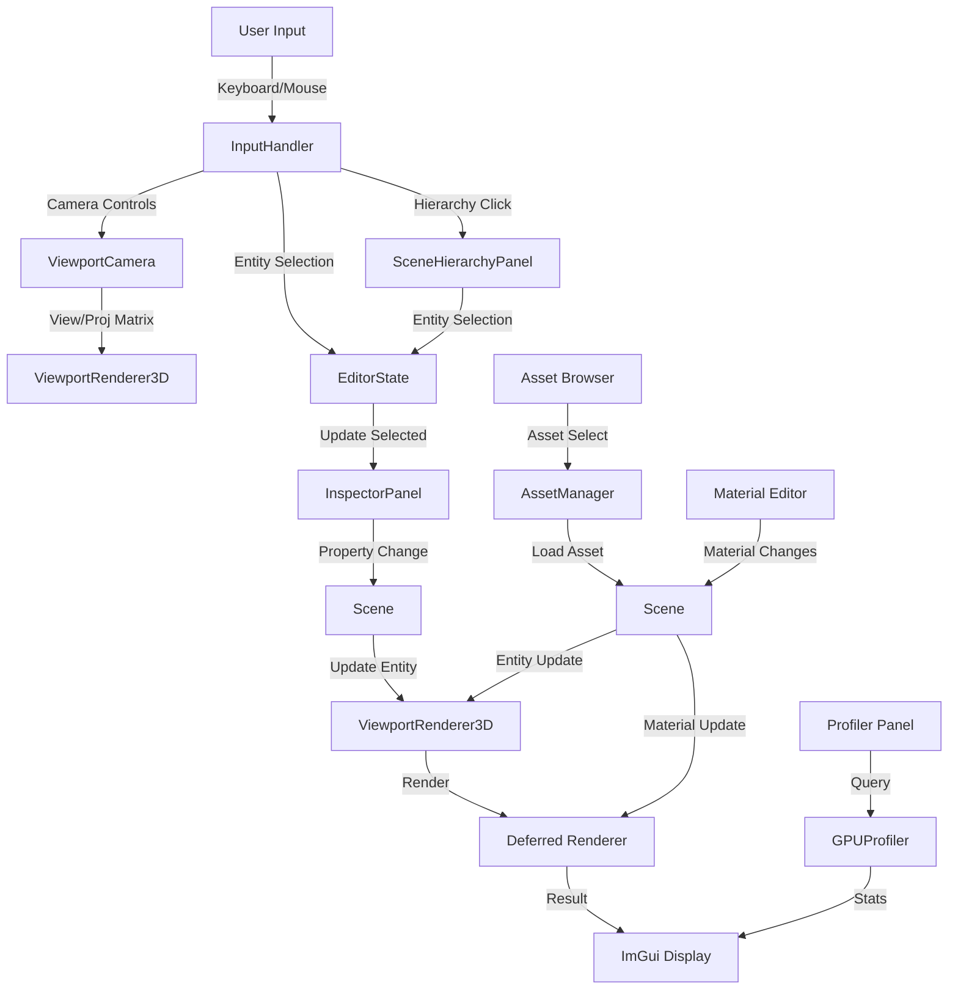

---

# CHARACTER CONTROLLER SYSTEM

## Overview
Manages player movement, state transitions, and input-driven locomotion.

## Architecture

```mermaid
classDiagram
    %% Core Character Controller
    class CharacterController {
        -entity: Entity
        -physics_body: RigidBody
        -transform: Transform
        -animator: Animator
        -state_machine: CharacterStateMachine
        -input_buffer: InputBuffer
        -locomotion_system: LocomotionSystem
        -stats: CharacterStats
        -current_velocity: vec3
        +Initialize()
        +Update()
        +ProcessInput()
        +ApplyMovement()
        +Jump()
        +Dash()
        +TakeDamage()
        +GetStats()
    }
    
    class CharacterStateMachine {
        -current_state: CharacterState
        -states: map~CharacterStateType,CharacterState~
        -transitions: vector~StateTransition~
        +AddState()
        +TransitionTo()
        +Update()
        +CanTransitionTo()
    }
    
    class CharacterState {
        #name: string
        #type: CharacterStateType
        #owner: CharacterController
        +OnEnter()
        +OnUpdate()
        +OnExit()
        +CanTransitionTo()
        +GetAnimationState()
    }
    
    class IdleState {
        -idle_duration: float
        +OnUpdate()
        +CanTransitionTo()
    }
    
    class WalkState {
        -walk_speed: float
        -acceleration: float
        +OnUpdate()
        +ApplyMovement()
    }
    
    class SprintState {
        -sprint_speed: float
        -stamina_cost: float
        -acceleration: float
        +OnUpdate()
        +CanMaintain()
    }
    
    class JumpState {
        -jump_force: float
        -peak_time: float
        -current_time: float
        +OnEnter()
        +OnUpdate()
        +OnLand()
    }
    
    class DashState {
        -dash_direction: vec3
        -dash_force: float
        -dash_duration: float
        -cooldown: float
        +OnEnter()
        +OnUpdate()
        +OnCooldown()
    }
    
    class FallState {
        -fall_start_height: float
        -fall_damage_threshold: float
        +OnEnter()
        +OnUpdate()
        +OnLand()
        +CalculateFallDamage()
    }
    
    class WallRunState {
        -wall_normal: vec3
        -wall_run_speed: float
        -wall_detection_range: float
        +OnEnter()
        +OnUpdate()
        +DetectWall()
        +ApplyWallRunMovement()
    }
    
    class ClimbState {
        -climb_speed: float
        -can_climb: bool
        -climbable_angle: float
        +OnEnter()
        +OnUpdate()
        +ApplyClimbMovement()
        +CheckClimbable()
    }
    
    class SlideState {
        -slide_speed: float
        -slide_duration: float
        -slide_direction: vec3
        +OnEnter()
        +OnUpdate()
        +ApplySlideMovement()
    }
    
    class StateTransition {
        +from_state: CharacterStateType
        +to_state: CharacterStateType
        +condition: function
        +priority: uint32
    }
    
    %% Input Handling
    class InputBuffer {
        -buffer_size: uint32
        -inputs: queue~InputAction~
        -input_history: vector~InputFrame~
        +BufferInput()
        +GetNextInput()
        +IsInputAvailable()
        +GetInputHistory()
        +Clear()
    }
    
    class InputAction {
        +type: InputActionType
        +key: int
        +timestamp: float
        +pressed: bool
    }
    
    class InputFrame {
        +inputs: vector~InputAction~
        +timestamp: float
    }
    
    %% Locomotion System
    class LocomotionSystem {
        -blend_tree: BlendTree2D
        -speed_modifier: float
        -acceleration_modifier: float
        -friction: float
        +CalculateDesiredVelocity()
        +BlendAnimations()
        +ApplyFriction()
        +UpdateMovementSpeed()
    }
    
    class BlendTree2D {
        -space: vector~BlendTreeNode~
        -current_blend: vec2
        +Sample()
        +GetAnimationBlend()
        +AddNode()
        +CalculateWeights()
    }
    
    class BlendTreeNode {
        +position: vec2
        +animation: AnimationClip
        +weight: float
    }
    
    %% Character Stats
    class CharacterStats {
        -health: float
        -max_health: float
        -stamina: float
        -max_stamina: float
        -armor: float
        -resistances: array~float,5~
        -modifiers: vector~StatModifier~
        +ApplyDamage()
        +Heal()
        +RegenerateStamina()
        +ApplyModifier()
        +RemoveModifier()
        +CalculateEffectiveStat()
    }
    
    class StatModifier {
        +type: ModifierType
        +value: float
        +source: string
        +duration: float
        +remaining_time: float
        +Update()
        +IsExpired()
    }
    
    %% Ground Detection
    class GroundDetector {
        -raycast_count: uint32
        -raycast_radius: float
        -raycast_distance: float
        -ground_layers: uint32
        +IsOnGround()
        +GetGroundNormal()
        +GetGroundMaterial()
        +GetSurfaceProperties()
    }
    
    %% Camera Control
    class CharacterCamera {
        -target: Entity
        -offset: vec3
        -distance: float
        -pitch: float
        -yaw: float
        -orbit_sensitivity: float
        -zoom_speed: float
        +Update()
        +Orbit()
        +Zoom()
        +GetCameraMatrix()
        +LookAtTarget()
    }
    
    %% Relationships
    CharacterController --> CharacterStateMachine
    CharacterController --> RigidBody
    CharacterController --> Animator
    CharacterController --> InputBuffer
    CharacterController --> LocomotionSystem
    CharacterController --> CharacterStats
    CharacterController --> GroundDetector
    CharacterController --> CharacterCamera
    
    CharacterStateMachine --> CharacterState
    CharacterState <|-- IdleState
    CharacterState <|-- WalkState
    CharacterState <|-- SprintState
    CharacterState <|-- JumpState
    CharacterState <|-- DashState
    CharacterState <|-- FallState
    CharacterState <|-- WallRunState
    CharacterState <|-- ClimbState
    CharacterState <|-- SlideState
    CharacterStateMachine --> StateTransition
    
    InputBuffer --> InputAction
    InputBuffer --> InputFrame
    
    LocomotionSystem --> BlendTree2D
    BlendTree2D --> BlendTreeNode
    
    CharacterStats --> StatModifier
```

## Character Controller Data Flow

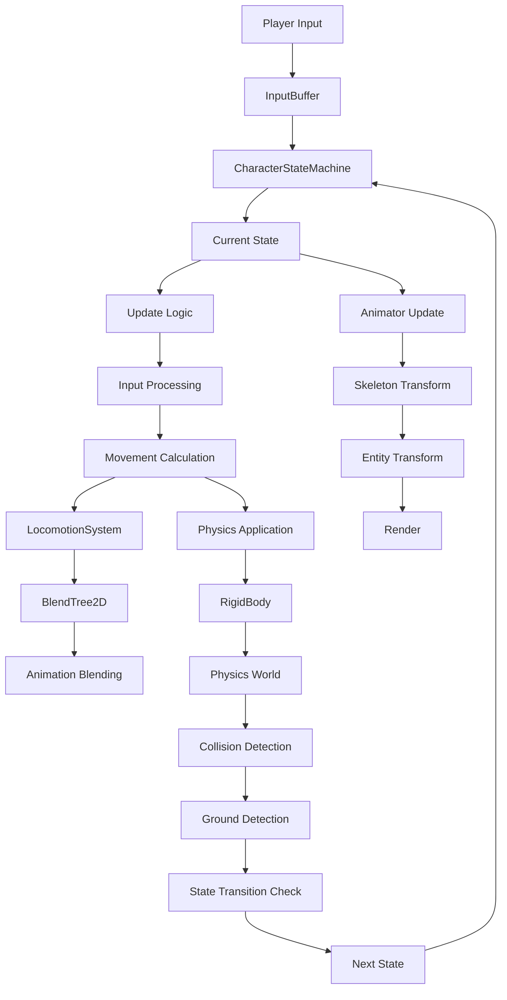

---

# ABILITY/SKILL SYSTEM

## Overview
Implements Destiny 2-style modifier pipeline with abilities, skills, and modifiers.

## Architecture

```mermaid
classDiagram
    %% Ability System Core
    class AbilitySystem {
        -character: CharacterController
        -abilities: map~string,Ability~
        -active_effects: vector~ActiveEffect~
        -modifier_stack: ModifierStack
        -cooldown_manager: CooldownManager
        +RegisterAbility()
        +ActivateAbility()
        +DeactivateAbility()
        +ApplyEffect()
        +RemoveEffect()
        +Update()
    }
    
    class Ability {
        #name: string
        #type: AbilityType
        #cost: AbilityCost
        #cooldown: float
        #cast_time: float
        #animation: string
        #effects: vector~Effect~
        #modifiers: vector~AbilityModifier~
        +CanActivate()
        +Activate()
        +Update()
        +Deactivate()
        +ApplyEffects()
        +GetCost()
        +SetModifier()
    }
    
    class AbilityCost {
        +mana: float
        +stamina: float
        +health_percentage: float
        +resource_type: ResourceType
        +resource_amount: float
    }
    
    class AbilityModifier {
        +name: string
        +parameter: string
        +operation: ModifierOperation
        +value: float
        +modifier_type: ModifierType
        +ApplyModifier()
        +RemoveModifier()
    }
    
    class PassiveAbility {
        +always_active: bool
        +trigger_condition: function
        +OnTrigger()
    }
    
    class ActiveAbility {
        +can_queue: bool
        +queue_window: float
        +instant_cast: bool
        +requires_target: bool
        +Activate()
    }
    
    class ChanneledAbility {
        +channel_duration: float
        +channel_total_time: float
        +channel_tick_rate: float
        +can_move_while_channeling: bool
        +OnChannelTick()
    }
    
    %% Ability Modifiers (Destiny-style)
    class ModifierStack {
        -active_modifiers: vector~Modifier~
        -applied_stats: map~string,float~
        +AddModifier()
        +RemoveModifier()
        +CalculateModifiedValue()
        +ApplyToStat()
        +GetActiveModifiers()
    }
    
    class Modifier {
        +name: string
        +source: string
        +type: ModifierType
        +operation: ModifierOperation
        +value: float
        +duration: float
        +remaining_time: float
        +stacking_behavior: StackingBehavior
        +Update()
        +Apply()
        +Remove()
    }
    
    class Effect {
        +name: string
        +type: EffectType
        +duration: float
        +tick_rate: float
        +damage_value: float
        +damage_type: DamageType
        +radius: float
        +Apply()
        +OnTick()
        +Remove()
    }
    
    class ActiveEffect {
        +ability: Ability
        +target: Entity
        +effect: Effect
        +start_time: float
        +next_tick_time: float
        +remaining_duration: float
        +Update()
    }
    
    %% Skill Tree
    class SkillTree {
        -nodes: vector~SkillNode~
        -connections: vector~SkillConnection~
        -unlocked_nodes: set~uint32~
        -skill_points: uint32
        +UnlockNode()
        +LockNode()
        +GetUnlockedNodes()
        +GetRequiredNodes()
        +CanUnlock()
        +GetSkillsGranted()
    }
    
    class SkillNode {
        +id: uint32
        +name: string
        +description: string
        +position: vec2
        +required_points: uint32
        +unlocked: bool
        +abilities_granted: vector~string~
        +modifiers: vector~Modifier~
        +prerequisites: vector~uint32~
    }
    
    class SkillConnection {
        +from_node: uint32
        +to_node: uint32
        +requirement_type: RequirementType
    }
    
    %% Cooldown Management
    class CooldownManager {
        -cooldowns: map~string,Cooldown~
        +AddCooldown()
        +ReduceCooldown()
        +IsOnCooldown()
        +GetRemainingCooldown()
        +ResetCooldown()
        +Update()
    }
    
    class Cooldown {
        +ability_name: string
        +total_duration: float
        +remaining_time: float
        +charges: uint32
        +charges_max: uint32
        +charge_cooldown: float
        +Update()
    }
    
    %% Resource Management
    class ResourceManager {
        -resources: map~string,Resource~
        +AddResource()
        +RemoveResource()
        +GetResourceAmount()
        +ModifyResource()
        +CanAfford()
    }
    
    class Resource {
        +name: string
        +current: float
        +maximum: float
        +regeneration_rate: float
        +regeneration_delay: float
        +Update()
        +Restore()
        +Deplete()
    }
    
    %% Relationships
    AbilitySystem --> Ability
    AbilitySystem --> ActiveEffect
    AbilitySystem --> ModifierStack
    AbilitySystem --> CooldownManager
    AbilitySystem --> SkillTree
    AbilitySystem --> ResourceManager
    
    Ability --> AbilityCost
    Ability --> AbilityModifier
    Ability --> Effect
    
    Ability <|-- PassiveAbility
    Ability <|-- ActiveAbility
    Ability <|-- ChanneledAbility
    
    ModifierStack --> Modifier
    ActiveEffect --> Ability
    ActiveEffect --> Effect
    
    SkillTree --> SkillNode
    SkillTree --> SkillConnection
    
    CooldownManager --> Cooldown
    ResourceManager --> Resource
```

## Ability System Data Flow

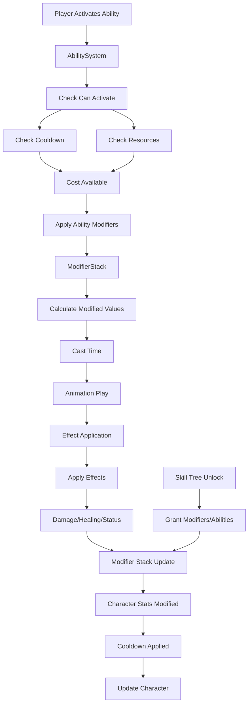

---

# AI SYSTEM

## Overview
Implements intelligent NPC behavior with decision trees, pathfinding, and combat AI.

## Architecture

```mermaid
classDiagram
    %% AI Core
    class AIController {
        -character: CharacterController
        -behavior_tree: BehaviorTree
        -blackboard: Blackboard
        -perception_system: PerceptionSystem
        -decision_maker: DecisionMaker
        -pathfinding_agent: PathfindingAgent
        -ai_stats: AIStats
        -current_behavior: Behavior
        +Initialize()
        +Update()
        +OnPerceptEvent()
        +MakeDecision()
        +ExecuteBehavior()
    }
    
    class BehaviorTree {
        -root: BehaviorNode
        -blackboard: Blackboard
        -status: NodeStatus
        +Tick()
        +Evaluate()
        +Reset()
        +GetStatus()
    }
    
    class BehaviorNode {
        #node_type: NodeType
        #children: vector~BehaviorNode~
        #status: NodeStatus
        +Tick()$
        +Update()$
        +Reset()$
    }
    
    class SelectorNode {
        +Tick()
    }
    
    class SequenceNode {
        +Tick()
    }
    
    class ParallelNode {
        +Tick()
    }
    
    class TaskNode {
        -task: BehaviorTask
        +Tick()
        +ExecuteTask()
    }
    
    class BehaviorTask {
        +Execute()
        +Check()
        +Terminate()
    }
    
    class MoveTask {
        -target: vec3
        -move_speed: float
        +Execute()
        +IsAtTarget()
    }
    
    class AttackTask {
        -target: Entity
        -attack_ability: Ability
        +Execute()
        +IsTargetInRange()
    }
    
    class PatrolTask {
        -waypoints: vector~vec3~
        -current_waypoint: uint32
        +Execute()
        +NextWaypoint()
    }
    
    class PerceptionSystem {
        -max_perception_range: float
        -memory: EntityMemory
        -senses: vector~Sense~
        +UpdatePerception()
        +CanSee()
        +CanHear()
        +RememberEntity()
        +GetMemorizedEntities()
    }
    
    class EntityMemory {
        -entities: map~uint32,MemorizedEntity~
        +Remember()
        +Forget()
        +GetLastKnownPosition()
        +GetThreatLevel()
    }
    
    class MemorizedEntity {
        +entity_id: uint32
        +last_position: vec3
        +last_seen_time: float
        +threat_level: float
        +confidence: float
    }
    
    class Sense {
        +type: SenseType
        +range: float
        +angle: float
        +Check()
        +GetDetectedObjects()
    }
    
    %% Decision Making
    class DecisionMaker {
        -decision_tree: DecisionTree
        -priority_evaluators: vector~PriorityEvaluator~
        -current_goal: Goal
        -goal_history: vector~Goal~
        +EvaluateDecisions()
        +SelectBestDecision()
        +UpdatePriorities()
    }
    
    class DecisionTree {
        -root: DecisionNode
        +Evaluate()
        +GetBestDecision()
    }
    
    class DecisionNode {
        +condition: function
        +decision: Decision
        +Evaluate()
    }
    
    class Decision {
        +priority: float
        +goal: Goal
        +behavior: Behavior
        +Evaluate()
    }
    
    class Goal {
        +name: string
        +priority: float
        +target: Entity
        +target_position: vec3
        +deadline: float
        +active: bool
    }
    
    class PriorityEvaluator {
        +name: string
        +weight: float
        +Evaluate()
    }
    
    %% Pathfinding
    class PathfindingAgent {
        -navmesh: Navmesh
        -path: vector~vec3~
        -current_waypoint: uint32
        -move_speed: float
        +FindPath()
        +FollowPath()
        +GetNextWaypoint()
        +ReachedTarget()
        +Avoid()
    }
    
    class Navmesh {
        -triangles: vector~NavmeshTriangle~
        -graph: NavmeshGraph
        +FindPath()
        +ProjectPoint()
        +GetCrossableEdges()
    }
    
    class NavmeshTriangle {
        +vertices: array~vec3,3~
        +edges: array~NavmeshEdge,3~
        +id: uint32
    }
    
    %% Combat AI
    class CombatAI {
        -controller: AIController
        -target: Entity
        -combat_range: float
        -preferred_range: float
        -ability_selection: AbilitySelector
        -positioning: PositioningManager
        +UpdateTargetTracking()
        +SelectAbility()
        +MaintainPosition()
        +Retreat()
        +Execute()
    }
    
    class AbilitySelector {
        -abilities: vector~Ability~
        -ability_scores: map~string,float~
        +ScoreAbilities()
        +SelectBestAbility()
        +CanUseAbility()
    }
    
    class PositioningManager {
        -combat_range: float
        -preferred_distance: float
        -avoidance_radius: float
        +CalculateIdealPosition()
        +AvoidAOE()
        +MaintainDistance()
    }
    
    %% AI Stats & Configuration
    class AIStats {
        +difficulty: DifficultyLevel
        +reaction_time: float
        +accuracy: float
        +awareness: float
        +aggressiveness: float
        +intelligence: float
    }
    
    class Blackboard {
        -data: map~string,variant~
        +SetValue()
        +GetValue()
        +HasKey()
        +Clear()
    }
    
    %% Relationships
    AIController --> BehaviorTree
    AIController --> Blackboard
    AIController --> PerceptionSystem
    AIController --> DecisionMaker
    AIController --> PathfindingAgent
    AIController --> CombatAI
    AIController --> AIStats
    
    BehaviorTree --> BehaviorNode
    BehaviorTree --> Blackboard
    BehaviorNode <|-- SelectorNode
    BehaviorNode <|-- SequenceNode
    BehaviorNode <|-- ParallelNode
    BehaviorNode <|-- TaskNode
    TaskNode --> BehaviorTask
    BehaviorTask <|-- MoveTask
    BehaviorTask <|-- AttackTask
    BehaviorTask <|-- PatrolTask
    
    PerceptionSystem --> EntityMemory
    PerceptionSystem --> Sense
    EntityMemory --> MemorizedEntity
    
    DecisionMaker --> DecisionTree
    DecisionMaker --> PriorityEvaluator
    DecisionTree --> DecisionNode
    DecisionNode --> Decision
    DecisionNode --> Goal
    
    PathfindingAgent --> Navmesh
    Navmesh --> NavmeshTriangle
    
    CombatAI --> AbilitySelector
    CombatAI --> PositioningManager
```

---

# NETWORKING SYSTEM

## Overview
Deterministic replication system for multiplayer with rollback capability.

## Architecture

```mermaid
classDiagram
    %% Network Core
    class NetworkManager {
        -server_connection: ServerConnection
        -local_player: NetworkPlayer
        -remote_players: map~uint32,NetworkPlayer~
        -network_world: NetworkWorld
        -tick_rate: uint32
        -current_tick: uint64
        -frame_delay: uint32
        +Initialize()
        +Connect()
        +Disconnect()
        +Update()
        +SendInput()
        +ReceiveGameState()
    }
    
    class ServerConnection {
        -socket: NetworkSocket
        -server_address: string
        -server_port: uint16
        -is_connected: bool
        -last_ack_tick: uint64
        +Connect()
        +SendPacket()
        +ReceivePacket()
        +Disconnect()
        +IsConnected()
    }
    
    class NetworkPacket {
        +packet_type: PacketType
        +sender_id: uint32
        +tick: uint64
        +sequence_number: uint32
        +payload: vector~uint8~
        +Serialize()
        +Deserialize()
    }
    
    class InputPacket {
        +tick: uint64
        +player_id: uint32
        +inputs: vector~InputAction~
        +timestamp: float
    }
    
    class GameStatePacket {
        +tick: uint64
        +entities: vector~EntityState~
        +physics_state: PhysicsState
        +timestamp: float
    }
    
    %% Deterministic Simulation
    class DeterministicSimulation {
        -tick_rate: uint32
        -fixed_timestep: float
        -fixed_tick_buffer: FixedTickBuffer
        -rollback_manager: RollbackManager
        +TickSimulation()
        +RollBackToTick()
        +FastForwardToTick()
        +IsDeterministic()
    }
    
    class FixedTickBuffer {
        -buffer: vector~TickFrame~
        -buffer_size: uint32
        -current_tick: uint64
        +StoreFrame()
        +GetFrame()
        +ClearOldFrames()
    }
    
    class TickFrame {
        +tick: uint64
        +entities: vector~EntityState~
        +inputs: vector~InputAction~
        +physics_world_state: PhysicsWorldState
    }
    
    class RollbackManager {
        -saved_states: map~uint64,GameState~
        -max_rollback_ticks: uint32
        +SaveState()
        +LoadState()
        +RollbackToTick()
        +FastForwardToTick()
        +DiscardStates()
    }
    
    %% Network Player
    class NetworkPlayer {
        -player_id: uint32
        -character: CharacterController
        -input_history: vector~InputAction~
        -predicted_position: vec3
        -confirmed_position: vec3
        -latency: uint32
        +SendInput()
        +ReceiveRemoteInput()
        +UpdatePrediction()
        +Reconcile()
    }
    
    class EntityState {
        +entity_id: uint32
        +position: vec3
        +rotation: quat
        +velocity: vec3
        +animation_state: string
        +health: float
        +active_effects: vector~string~
    }
    
    %% Network World
    class NetworkWorld {
        -entities: vector~NetworkEntity~
        -owner_map: map~uint32,uint32~
        -interest_manager: InterestManager
        +SpawnEntity()
        +DestroyEntity()
        +UpdateEntity()
        +ReplicateState()
        +GetRelevantEntities()
    }
    
    class NetworkEntity {
        +id: uint32
        +owner_id: uint32
        +state: EntityState
        +dirty_flags: uint32
        +last_update_tick: uint64
        +Position get set
        +Rotation get set
    }
    
    class InterestManager {
        -relevance_distance: float
        -update_threshold: float
        +ShouldReplicate()
        +GetRelevantEntities()
        +CalculateNeed()
    }
    
    %% Input Synchronization
    class InputSynchronizer {
        -local_input_buffer: InputBuffer
        -remote_input_buffer: InputBuffer
        -current_tick: uint64
        -frame_delay: uint32
        +BufferLocalInput()
        +BufferRemoteInput()
        +GetInputForTick()
        +Reconcile()
    }
    
    class RemoteInputBuffer {
        -buffer: map~uint64,vector~InputAction~~
        -max_buffer_size: uint32
        +BufferInput()
        +GetInput()
        +ClearOldInput()
    }
    
    %% Reconciliation
    class ReconciliationSystem {
        -local_state_buffer: vector~EntityState~
        -remote_state_buffer: vector~EntityState~
        -error_threshold: float
        +ReconcileState()
        +InterpolateState()
        +SmoothCorrection()
        +CalculateError()
    }
    
    %% Network Statistics
    class NetworkStats {
        +latency: uint32
        +packet_loss: float
        +jitter: uint32
        +bandwidth_used: float
        +bandwidth_available: float
        +tick_rate: uint32
        +CalculateStats()
    }
    
    %% Relationships
    NetworkManager --> ServerConnection
    NetworkManager --> NetworkPlayer
    NetworkManager --> NetworkWorld
    NetworkManager --> DeterministicSimulation
    NetworkManager --> InputSynchronizer
    NetworkManager --> NetworkStats
    
    ServerConnection --> NetworkPacket
    NetworkPacket <|-- InputPacket
    NetworkPacket <|-- GameStatePacket
    
    DeterministicSimulation --> FixedTickBuffer
    DeterministicSimulation --> RollbackManager
    FixedTickBuffer --> TickFrame
    RollbackManager --> TickFrame
    
    NetworkPlayer --> CharacterController
    NetworkWorld --> NetworkEntity
    NetworkWorld --> InterestManager
    
    InputSynchronizer --> InputBuffer
    InputSynchronizer --> RemoteInputBuffer
    
    ReconciliationSystem --> EntityState
```

---

# AUDIO SYSTEM

## Overview
Spatial 3D audio with miniaudio integration.

## Architecture

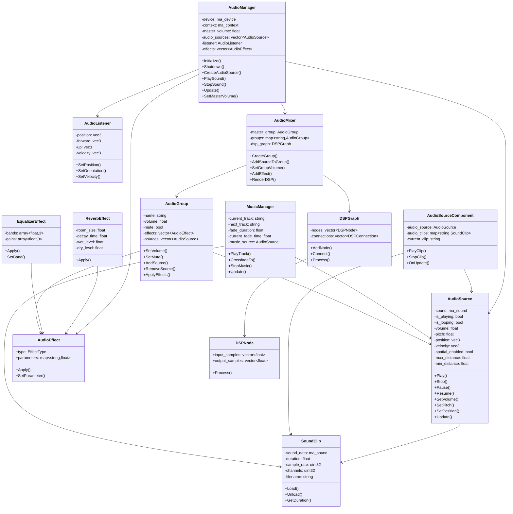

---

# PARTICLE SYSTEM

## Overview
GPU-based particle rendering with physics simulation.

## Architecture

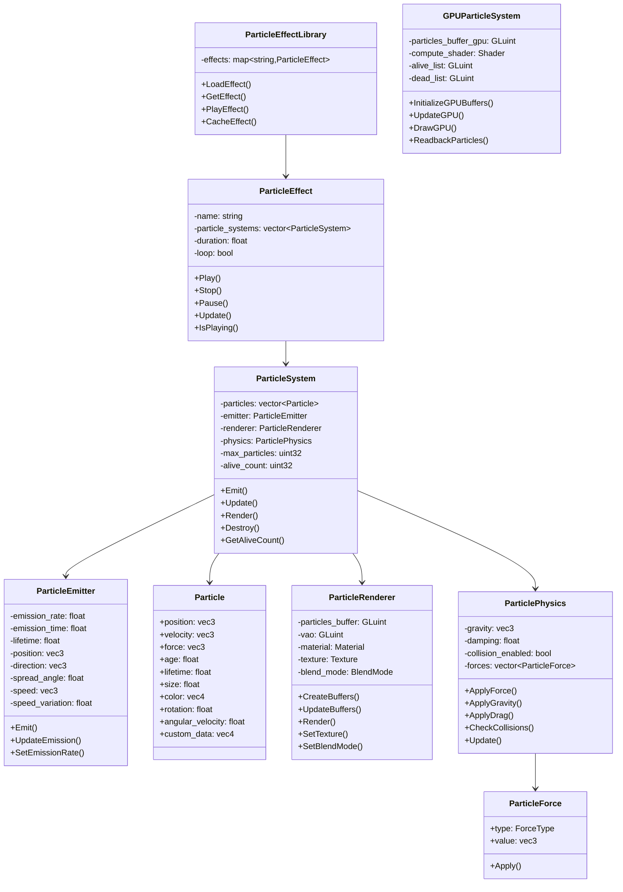

---

# WORLD STREAMING SYSTEM

## Architecture

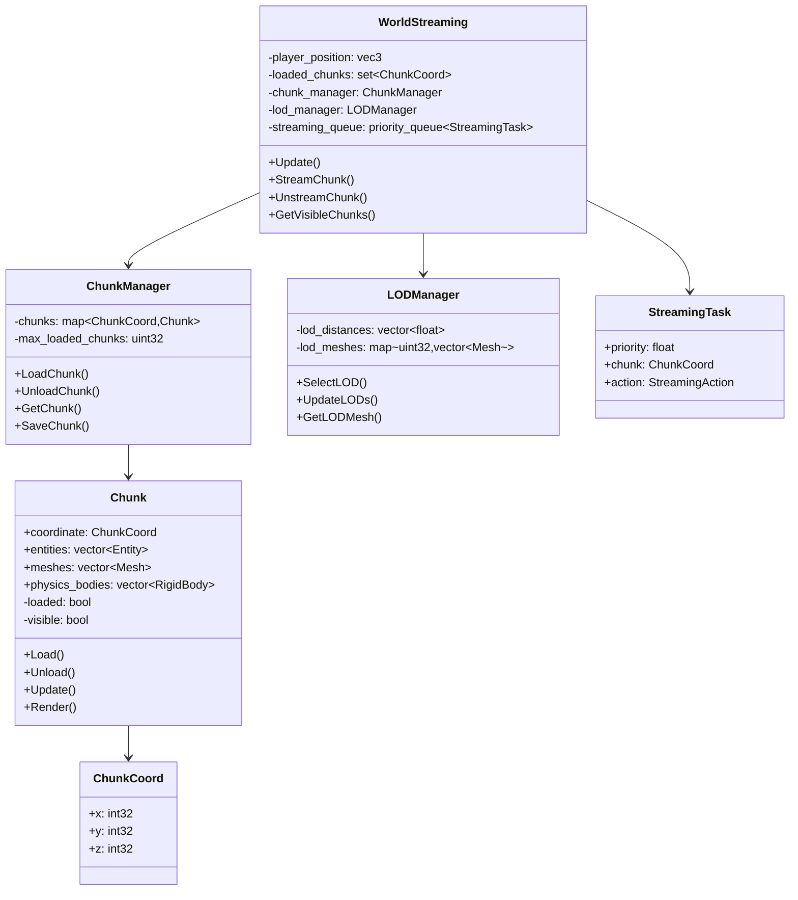

---

# QUEST/DIALOGUE SYSTEM

## Architecture

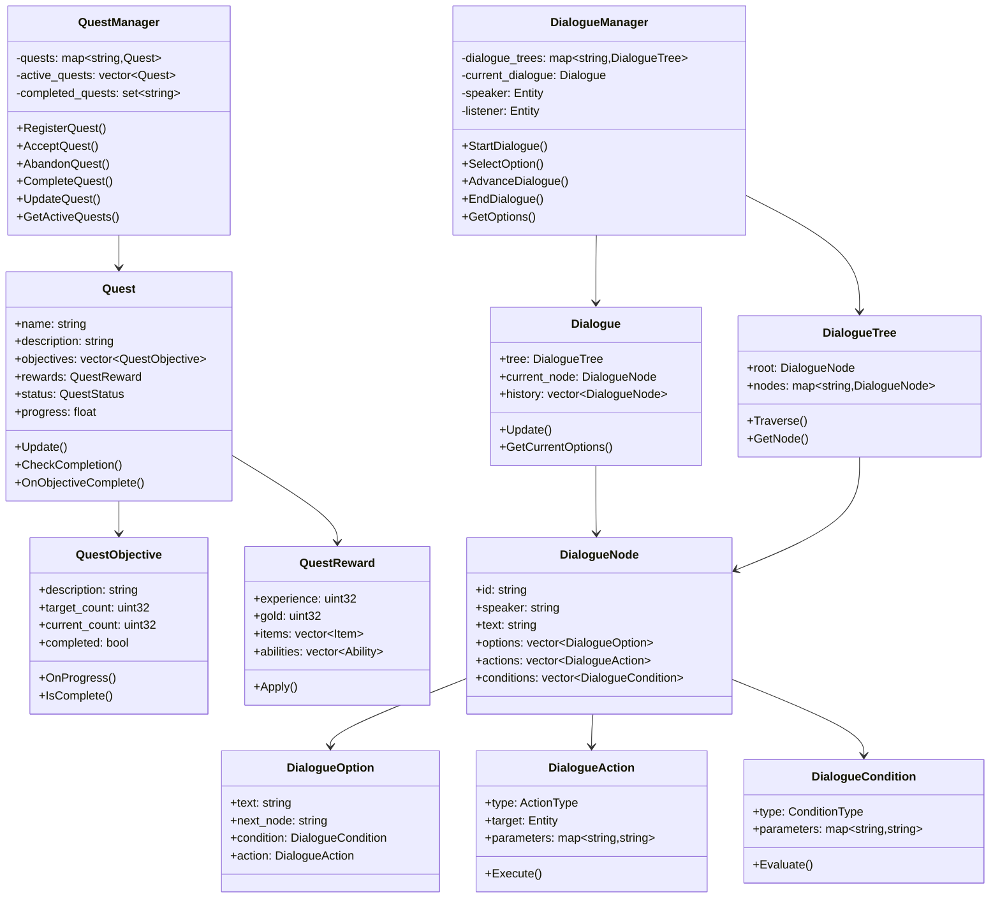

---

# INTEGRATION POINTS

## How All Systems Connect

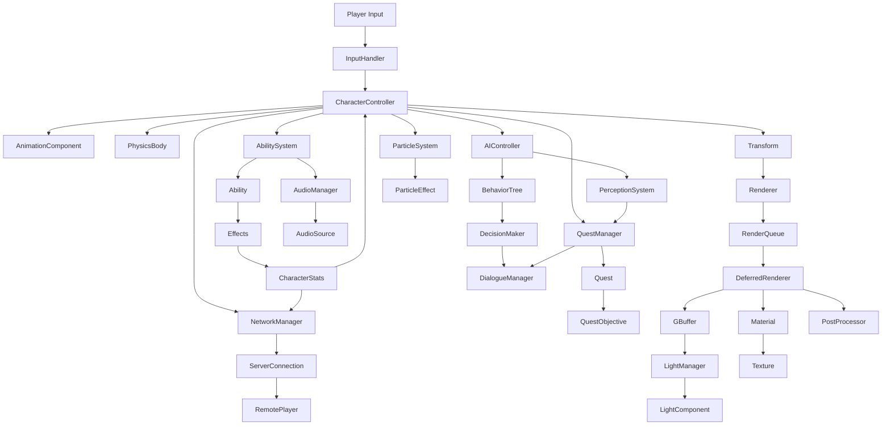

---

## Next Steps

This comprehensive architecture provides the foundation for all remaining systems. Each section includes:

1. **Class Diagrams** - All classes, methods, and relationships
2. **Data Flow** - How information moves through the system
3. **Integration Points** - How systems connect to each other
4. **Usage Patterns** - Example implementations

To implement each system:

1. Create header files with class declarations from diagrams
2. Implement cpp files following the data flow diagrams
3. Integrate into CMakeLists.txt
4. Connect integration points to existing systems
5. Add to Editor panels for configuration
6. Test with unit tests and integration tests
