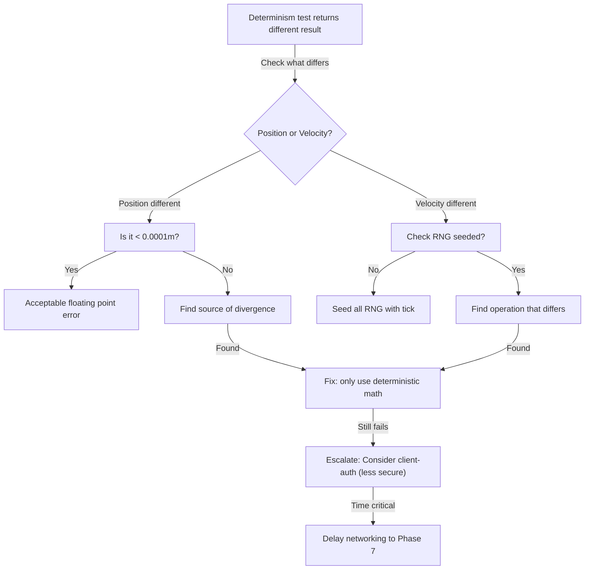

# Risk & Contingency Plan — Phase 6 Implementation

**Purpose:** Identify what could go wrong and how to respond before it happens

---

## RISK REGISTER

### 🟥 CRITICAL RISKS (Project Blockers)

#### R1: Networking Determinism Impossible to Achieve

| Risk | If networking can't be deterministic, rollback won't work and multiplayer is broken |
|------|---|
| **Probability** | 5% (unlikely if planned carefully) |
| **Impact** | 🔴 CRITICAL - Entire networking system fails |
| **Detection** | Determinism test fails: same input produces different results |
| **Prevention** | <ul><li>Plan determinism from start (done in NETWORKING-SPECIFICATION.md)</li><li>Enforce no RNG without seed</li><li>Review all floating point math for consistency</li></ul> |
| **Mitigation** | <ul><li>Switch to client-authoritative (less secure but works)</li><li>Implement server prediction layer (slower but guarantees)</li><li>Delay networking to Phase 7</li></ul> |
| **Owner** | Network Architect |
| **Action** | Week 8: Run determinism test. If fails, escalate immediately. |

#### R2: Physics Integration Causes Instability

| Risk | Physics system interference when Character + Animation + Network try to move entity |
|------|---|
| **Probability** | 15% (common integration issue) |
| **Impact** | 🔴 CRITICAL - Physics bugs cascade |
| **Detection** | Character clips through walls, floats, falls through ground, double-moves |
| **Prevention** | <ul><li>Clear physics API (already defined)</li><li>Physics updates ONCE per tick in deterministic order</li><li>Mock physics in tests</li></ul> |
| **Mitigation** | <ul><li>Disable physics integration temporarily</li><li>Use simplified physics (capsule only, no collision details)</li><li>Debug with physics visualization</li></ul> |
| **Owner** | Physics + Character Architect |
| **Action** | Week 2 integration test: physics + character both update, check frame budget. |

#### R3: Scope Creep — 12 Weeks Becomes 16+

| Risk | Features added mid-development delay remaining systems |
|------|---|
| **Probability** | 40% (very likely without discipline) |
| **Impact** | 🟠 HIGH - AI and Polish get cut |
| **Detection** | Week 6 tasks take 8 days instead of 5 |
| **Prevention** | <ul><li>Strict milestone enforcement</li><li>No feature additions without removing something else</li><li>Weekly standup tracking</li></ul> |
| **Mitigation** | <ul><li>Cut lower-priority features (quest system, audio)</li><li>Delay Phase 7 start</li><li>Parallel tracks if team grew</li></ul> |
| **Owner** | Project Manager |
| **Action** | Monitor week-by-week. At Day 15, review actual vs planned. |

---

### 🟧 HIGH RISKS

#### R4: Animator System Doesn't Scale

| Risk | Animation system designed for one character, breaks with multiple enemies |
|------|---|
| **Probability** | 20% |
| **Impact** | 🟠 HIGH - AI characters can't animate properly |
| **Detection** | 10+ AI characters on screen = frame drop or animation freezes |
| **Prevention** | <ul><li>Load test with 20 characters Week 3</li><li>Profile animation update() early</li><li>Use animation LOD (lower quality anims far away)</li></ul> |
| **Mitigation** | <ul><li>Reduce bone count for distant AI</li><li>Batch animation updates</li><li>Use skeletal mesh instancing</li></ul> |
| **Owner** | Animation + Performance Engineer |
| **Action** | Week 3 load test: 20 dancing characters, measure FPS. Target: > 30fps |

#### R5: Network Packet Size Too Large

| Risk | Character state + ability effects + modifiers exceeds bandwidth budget |
|------|---|
| **Probability** | 25% |
| **Impact** | 🟠 HIGH - Bandwidth cost prohibitive, game unplayable over internet |
| **Detection** | Network test shows > 50 Kbps per player (budget is 10 Kbps) |
| **Prevention** | <ul><li>Strict byte budget per packet (50 bytes max)</li><li>Delta compression (only send changes)</li><li>Quantize floats (position to 1cm precision)</li></ul> |
| **Mitigation** | <ul><li>Increase tick rate (send less frequently)</li><li>Remove ability effects from network (server-only)</li><li>Compress modifier list (IDs instead of strings)</li></ul> |
| **Owner** | Network Engineer |
| **Action** | Week 9: Network test with 8 players, measure actual bandwidth. |

#### R6: Input Latency Feels Bad

| Risk | Character doesn't respond immediately to input, feels sluggish |
|------|---|
| **Probability** | 30% |
| **Impact** | 🟠 HIGH - Game feels unresponsive, players frustrated |
| **Detection** | Frame time > 30ms or input has 3+ frame delay |
| **Prevention** | <ul><li>Input processed FIRST in frame</li><li>Physics timestep fixed (no variable dt)</li><li>Animation update early (not last)</li></ul> |
| **Mitigation** | <ul><li>Add input prediction layer</li><li>Reduce fixed timestep (10ms instead of 15ms)</li><li>Prioritize input processing in network tick</li></ul> |
| **Owner** | Character + Input Engineer |
| **Action** | Week 1: Measure controller latency. Target < 50ms total. |

---

### 🟨 MEDIUM RISKS

#### R7: Code Review Bottleneck

| Risk | Lead programmer becomes bottleneck, approving all PRs halts progress |
|------|---|
| **Probability** | 35% (depends on team size and process) |
| **Impact** | 🟡 MEDIUM - Developers blocked waiting for review |
| **Detection** | PR sitting > 48 hours without feedback |
| **Prevention** | <ul><li>Distribute review: 2 reviewers per PR</li><li>Code review checklist public (self-serve validation)</li><li>Establish time SLA (review within 24h)</li></ul> |
| **Mitigation** | <ul><li>Pair programming on critical systems</li><li>Reduce review scope (smaller PRs)</li><li>Async design meetings</li></ul> |
| **Owner** | Team Lead |
| **Action** | Week 1: Assign reviewers. Week 4: Audit process. |

#### R8: Character Animation State Machine Too Complex

| Risk | 8 states + transitions + blending becomes unmanageable spaghetti code |
|------|---|
| **Probability** | 20% |
| **Impact** | 🟡 MEDIUM - Bugs hard to debug, transitions fail |
| **Detection** | State machine has > 15 transitions, hard to trace bugs |
| **Prevention** | <ul><li>Transition logic in separate file</li><li>Diagram all states/transitions visually</li><li>Test state combinations systematically</li></ul> |
| **Mitigation** | <ul><li>Simplify to 5 core states (Idle, Walk, Sprint, Jump, Fall)</li><li>Use parameter-based transitions instead of explicit</li><li>Refactor into hierarchical state machine</li></ul> |
| **Owner** | Character Architect |
| **Action** | Week 2: Draw state diagram. Week 3: Complexity review. |

#### R9: Modifier Stack Math Bugs

| Risk | Floating point precision issues, stacking order bugs, edge cases |
|------|---|
| **Probability** | 25% |
| **Impact** | 🟡 MEDIUM - Abilities deal wrong damage, balance broken |
| **Detection** | Ability does 73 damage instead of 75, inconsistent results |
| **Prevention** | <ul><li>Unit test every modifier combination</li><li>Fixed-point math (no floats, use int × 0.01)</li><li>Comprehensive test matrix</li></ul> |
| **Mitigation** | <ul><li>Use fixed-point arithmetic throughout</li><li>Add debug mode showing modifier calculations</li><li>Cap precision to 0.01 (no sub-cent values)</li></ul> |
| **Owner** | Ability Architect |
| **Action** | Week 6: Comprehensive modifier tests (20+ combinations). |

---

### 🟩 LOW RISKS

#### R10: Build Times Increase (< 2 min → > 5 min)

| Risk | Adding character + ability systems increases compile time significantly |
|------|---|
| **Probability** | 50% (likely as codebase grows) |
| **Impact** | 🟢 LOW - Developers frustrated, minor productivity loss |
| **Detection** | Clean build takes > 5 minutes |
| **Prevention** | <ul><li>Use pre-compiled headers (PCH)</li><li>Forward declarations instead of includes</li><li>Incremental builds during development</li></ul> |
| **Mitigation** | <ul><li>Enable parallel compilation (-j 8)</li><li>Use CMake ccache</li><li>Move to modular builds</li></ul> |
| **Owner** | Build Engineer |
| **Action** | Week 2: Measure clean build time. If > 3 min, optimize. |

#### R11: Documentation Becomes Outdated

| Risk | Code changes but docs don't, documentation misleads developers |
|------|---|
| **Probability** | 60% (very common) |
| **Impact** | 🟢 LOW - Developers confused, but they figure it out |
| **Detection** | Documentation example doesn't compile or shows wrong method |
| **Prevention** | <ul><li>Link docs to actual code (not copy-paste)</li><li>Run example code as part of CI</li><li>Review docs in code review</li></ul> |
| **Mitigation** | <ul><li>Keep README minimal, link to code</li><li>Update docs when changing public API</li><li>Weekly doc audit</li></ul> |
| **Owner** | Technical Writer (if exists) or Lead Dev |
| **Action** | Week 1: Set up doc review process. Every PR updates docs if API changes. |

---

## CONTINGENCY RESPONSE FLOWS

### If Determinism Test Fails (R1)



### If Physics Clipping (R2)

```
1. Gather data:
   - When does clipping happen? (Jump? Sprint?)
   - Which objects involved?
   - Reproducible?

2. Debug:
   - Visualize physics colliders in editor
   - Check character collider size reasonable
   - Is physics body kinematic or dynamic?

3. Test:
   - Physics alone (no character) - clips? → Physics bug
   - Character alone (no physics) - clips? → Character bug
   - Both together - clips? → Integration bug

4. Fix by priority:
   - Increase collider margin (quick)
   - Reduce movement speed (quick)
   - Fix underlying collision system (hard)
```

### If Scope Creep Detected (R3)

```
Timeline check at Week 6 midpoint:

Expected done: Character + Animation + Ability basics
Actual: Still fixing animation blending

Decision tree:
- Cut: Remove feature from Phase 6 (quest system, audio)
- Delay: Push Phase 7 start 1 week
- Parallel: Add team member to parallelize work
- Scope down: Fewer abilities, fewer AI behaviors

Pick one, communicate to team, adjust roadmap.
```

### If Animation Performance Bad (R4)

```
If FPS drops with 10+ characters:

1. Profile animation system
   - Is bone hierarchy calculation slow?
   - Are blend trees expensive?
   - Skinning GPU-bound?

2. Solutions by severity:
   - Mild drop (60→45fps): Use LOD anims for distant chars
   - Severe drop (60→20fps): Batch skeleton updates
   - Critical (60→10fps): Replace skeletal anim with simpler rig

3. Test improvement:
   - Measure FPS after each optimization
   - Track: 20 characters should be > 30fps
```

---

## WEEKLY RISK ASSESSMENT TEMPLATE

Use this every Friday:

```
WEEK [#] RISK ASSESSMENT
========================

Critical Risk Status (R1-R3):
  R1 Networking determinism: [ ] Green [ ] Yellow [ ] Red
     Comment: _______
  
  R2 Physics integration: [ ] Green [ ] Yellow [ ] Red
     Comment: _______
  
  R3 Scope creep: [ ] Green [ ] Yellow [ ] Red
     Comment: _______

High Risk Status (R4-R6):
  R4 Animator scaling: [ ] Green [ ] Yellow [ ] Red
  R5 Network bandwidth: [ ] Green [ ] Yellow [ ] Red
  R6 Input latency: [ ] Green [ ] Yellow [ ] Red

New Risks Identified This Week:
  1. ___________
  2. ___________

Mitigations Applied:
  - ___________
  - ___________

Blockers Needing Escalation:
  - ___________
```

---

## EARLY WARNING SIGNS

Watch for these and escalate immediately:

| Warning Sign | Risk It Indicates | Action |
|---|---|---|
| "I'll fix it in the next sprint" (said multiple times) | R3 Scope creep | Escalate to PM |
| Animation jitter with multiple characters | R4 Animator performance | Profile immediately |
| Packet size measurements skipped | R5 Bandwidth | Do measurements today |
| Physics clipping during jump | R2 Physics instability | Debug immediately |
| Determinism test run not scheduled | R1 Networking | Schedule NOW |
| Code review PRs waiting > 48h | R7 Review bottleneck | Add reviewer |
| "State machine is getting complex" | R8 Complexity | Refactor now before worse |

---

## ESCALATION PATH

```
Developer finds issue
        ↓
Run triage (5 min): Is it catastrophic?
        ↓
    YES → Escalate to Architect immediately
    NO → File GitHub issue, add to next standup
        ↓
Architect evaluates (15 min)
        ↓
    Blocker? → Halt other work, fix now
    Important? → Schedule this week
    Nice-to-have? → Schedule next week
```

---

## SUCCESS CRITERIA (No Major Risks Realized)

✅ By end of Phase 6:
- Networking determinism tests pass (R1)
- Physics integration stable, no clipping (R2)
- Delivered on 12-week timeline (R3)
- 20 characters render > 30fps (R4)
- Network bandwidth < 15 Kbps per player (R5)
- Input latency < 50ms (R6)
- Code review SLA met 90% of time (R7)
- State machine comprehensible (R8)
- Damage calculations consistent (R9)
- Clean build < 3 min ( R10)
- Docs match code (R11)

---

